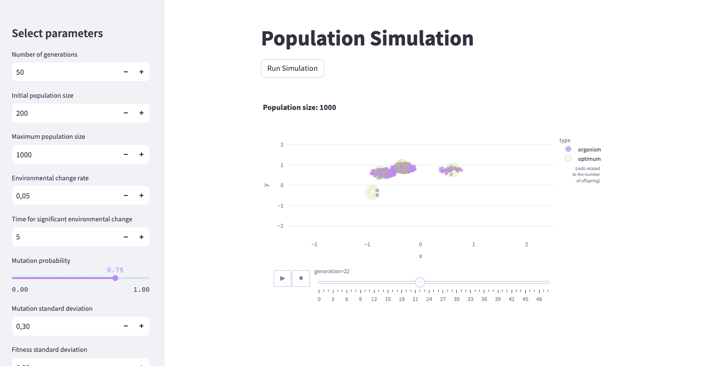

# Aplikacja do symulacji ewolucji populacji



## Opis Aplikacji

Jest to aplikacja **Streamlit** do symulowania ewolucji populacji. W aplikacji można zmieniać różne parametry, takie jak:

- Liczba pokoleń
- Prawdopodobieństwo mutacji
- Maksymalna liczba potomstwa

i wiele innych. Dzięki temu, możesz obserwować, jak te parametry wpływają na rozwój populacji.

## Wymagane Biblioteki

Do uruchomienia tego programu potrzebujesz pewnych bibliotek. Możesz je zainstalować za pomocą poniższej komendy:
```pip install -r requirements.txt```

## Uruchomienie Programu

Aby uruchomić program, przejdź do katalogu źródłowego i wpisz następującą komendę:
```streamlit run app.py```
